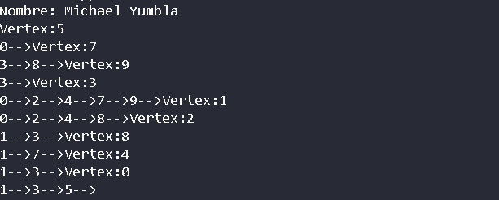

# Práctica de Grafos

## 📌 Información General

- **Título:** Práctica de Grafos
- **Asignatura:** Estructura de Datos
- **Carrera:** Computación
- **Estudiante:** Michael Yumbla
- **Fecha:** 11/07/2025
- **Profesor:** Ing. Pablo Torres

---

## 🛠️ Descripción
### Funcionamiento
Creación del grafo: Se instancia un objeto Graph llamado grafo1.

Adición de nodos: Se crean 9 nodos (n0 a n5, n7 a n9) usando el método addNode().

Conexión de nodos: Se establecen conexiones (aristas) entre los nodos con addEdge().

Impresión del grafo: Finalmente se imprime la estructura del grafo con printGraph().

### Como funciona
La clase Graph gestiona los nodos y sus conexiones internamente.

Cada Node representa un vértice del grafo.

Los métodos addNode() y addEdge() construyen la estructura de datos del grafo.

printGraph() muestra la representación visual de las conexiones.

---

## 🚀 Ejecución

Para ejecutar el proyecto:

1. Compila el código:
    ```bash
    javac App.java
    ```
2. Ejecuta la aplicación:
    ```bash
    java App
    ```

---

## 🧑‍💻 Ejemplo de Entrada

```plaintext
Nombre: Michael Yumbla
Vertex:5
0-->Vertex:7
3-->8-->Vertex:9
3-->Vertex:3
0-->2-->4-->7-->9-->Vertex:1
0-->2-->4-->8-->Vertex:2
1-->3-->Vertex:8
1-->7-->Vertex:4
1-->3-->Vertex:0
1-->3-->5-->
```
## Imagen 

---

